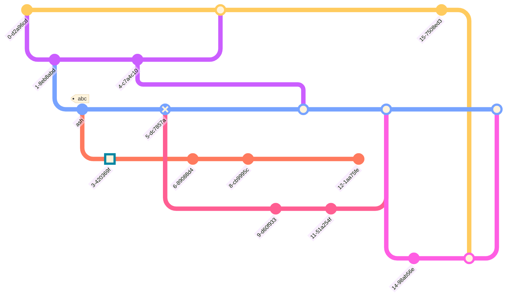

# Application de Gestion d'Inventaire

## Objectifs du Projet d'Application d'Inventaire

### Présentation Générale

Le projet vise à développer une **application de gestion d'inventaire** qui permet de gérer facilement les stocks de produits, suivre les quantités disponibles et organiser les inventaires pour les entreprises ou les utilisateurs individuels.
Cette solution vise à simplifier les processus de gestion d'inventaire et à fournir aux utilisateurs un contrôle total sur leurs stocks tout en offrant une traçabilité complète.

---

### Fonctionnalités Clés

1. **Authentification Utilisateur :**  
   - Permet à l'utilisateur de se connecter à l'application via un système de login sécurisé.

2. **Création d'Inventaires :**  
   - Les utilisateurs peuvent créer un nouvel inventaire avec un nom, une description, et d'autres paramètres spécifiques.
  
3. **Ajout d'Articles :**  
   - Ajout de nouveaux articles à l'inventaire avec des détails tels que le nom, la description, le prix, et la quantité disponible.
   L'ajout se fera par l'intermédiaire d'un formulaire sur lequel se trouvera toutes les informations liées à l'article (code, nom, quantité etc ...)

4. **Suppression d'Articles :**  
   - Suppression d'un article existant de l'inventaire en cas de besoin (par exemple, produit obsolète ou épuisé ou erreur utilisateur).

5. **Modification des Quantités :**  
   - Mise à jour de la quantité d'un article pour refléter les réceptions de marchandises ou les ventes effectuées.

6. **Clôture de l'Inventaire :**  
   - Possibilité de marquer un inventaire comme "clôturé" pour éviter toute modification ultérieure.  
   - Les inventaires clôturés sont conservés pour référence et audit, mais ne sont plus modifiables.

---

### Objectifs Techniques

1. **Architecture Full Stack :**  
   - Backend avec **Spring Boot** pour la gestion des données et des API REST.  
   - Frontend avec **React Native** pour une expérience utilisateur mobile fluide.  
   - Base de données relationnelle **MariaDB** pour le stockage des informations.

2. **Expérience Utilisateur :**  
   - Interface utilisateur intuitive et ergonomique pour faciliter la gestion des inventaires.  
   - Notifications pour confirmer les actions importantes (par exemple, suppression d'un article ou clôture d'inventaire).

3. **Sécurité :**  
   - Gestion sécurisée de l'authentification et des permissions utilisateur.  
   - Protection contre les accès non autorisés et les manipulations de données.

4. **Utilisation du gitworkflow**:
    - Contrôler les modifications des sources grâce au gitflow.

---

## Spécification technique

Ce projet est une **application de gestion d'inventaire** full-stack conçue pour suivre les produits, gérer les niveaux de stock et prendre en charge les opérations CRUD. La pile technologique comprend :

- **Backend :** Spring Boot
- **Frontend :** React Native
- **Base de données :** MariaDB

---

### Architecture du Projet

Un descriptif des couches logiques applicatives sont résumés par le schéma ci-dessous:


---
### Prise en Main

#### Prérequis

Assurez-vous que les outils suivants sont installés :

**obligatoire**:

- *Java 11* ou version supérieure
- *Node.js* et *npm*
- *Serveur MariaDB*
- *Git*
  
**recommendé**:

- *Lanceur de requête* Postman
- *IDE pour base de données* DBeaver
- *IDE pour les sources applicatives* VSCode
---

#### I) Configuration du Backend (Spring Boot)

##### 1) Initialisation du Projet

1. Visitez [Spring Initializr](https://start.spring.io/).
2. Sélectionnez :
   - **Projet :** Maven
   - **Langage :** Java
   - **Dépendances :** Spring Web, Spring Data JPA, MariaDB Driver
3. Générez et téléchargez le projet.
4. Extrayez le fichier ZIP et ouvrez le projet dans votre IDE.

##### 2) Configuration de la Connexion à la Base de Données

Modifiez le fichier `application.properties` :

```properties
spring.datasource.url=jdbc:mariadb://localhost:3306/inventory_db
spring.datasource.username=yourUsername
spring.datasource.password=yourPassword
spring.jpa.hibernate.ddl-auto=update
```

##### 3) Définir les Entités de la Base de Données

Créez une classe d'entité pour les produits :

```java
@Entity
public class Product {

    @Id
    @GeneratedValue(strategy = GenerationType.IDENTITY)
    private Long id;

    private String name;
    private String description;
    private Double price;
    private Integer quantity;

    // Getters et Setters
}
```

##### 4) Créer le Repository et le Contrôleur

**ProductRepository :**

```java
public interface ProductRepository extends JpaRepository<Product, Long> {}
```

**ProductController :**

```java
@RestController
@RequestMapping("/api/products")
public class ProductController {

    @Autowired
    private ProductRepository productRepository;

    @GetMapping
    public List<Product> getAllProducts() {
        return productRepository.findAll();
    }

    @PostMapping
    public Product createProduct(@RequestBody Product product) {
        return productRepository.save(product);
    }

    // Autres points de terminaison CRUD (PUT, DELETE) peuvent être ajoutés ici
}
```

##### 5) Exécution du Backend

Exécutez l'application en lançant `InventoryApplication.java` depuis votre IDE, ou depuis un terminal en lançant la commande:

```mvn spring-boot:run```

---

#### II) Configuration de la Base de Données (MariaDB)

##### 1) Connexion
1. Démarrez le serveur MariaDB.
2. Créez une nouvelle base de données :

```sql
CREATE DATABASE inventory_db;
```

3. Vérifiez la connexion en exécutant des requêtes de test à l'aide d'un outil comme **DBeaver** ou **MySQL Workbench**.

##### 2) Modélisation

Utilisez votre IDE ou l'invite de commande afin de créer le schéma de données de l'application.
Vous pouvez vous inspirer du diagramme ci-dessous:

##### Diagramme du Schéma de la Base de Données


---

#### III) Configuration du Frontend (React Native)

##### 1) Initialisation du Projet

```bash
npx react-native init InventoryApp
cd InventoryApp
```

##### 2) Installation des Dépendances

```bash
npm install axios react-navigation react-native-elements
```

##### 3) Créer le Service API

Dans `src/api/productService.js` :

```javascript
import axios from 'axios';

const API_URL = 'http://localhost:8080/api/products';

export const getProducts = async () => {
  try {
    const response = await axios.get(API_URL);
    return response.data;
  } catch (error) {
    console.error('Erreur lors de la récupération des produits :', error);
  }
};
```

##### 4) Concevoir les Composants UI

Créez un composant pour afficher la liste des produits :

```javascript
import React, { useEffect, useState } from 'react';
import { View, Text, FlatList, StyleSheet } from 'react-native';
import { getProducts } from './api/productService';

const ProductList = () => {
  const [products, setProducts] = useState([]);

  useEffect(() => {
    const fetchProducts = async () => {
      const productList = await getProducts();
      setProducts(productList);
    };

    fetchProducts();
  }, []);

  return (
    <View style={styles.container}>
      <FlatList
        data={products}
        keyExtractor={(item) => item.id.toString()}
        renderItem={({ item }) => (
          <Text style={styles.item}>{item.name} - {item.quantity}</Text>
        )}
      />
    </View>
  );
};

const styles = StyleSheet.create({
  container: {
    flex: 1,
    padding: 24,
    backgroundColor: '#f8f8f8'
  },
  item: {
    padding: 10,
    fontSize: 18,
  },
});

export default ProductList;
```

##### 5) Tester le Frontend

Exécutez l'application :

```bash
npx react-native run-android # Pour Android
npx react-native run-ios    # Pour iOS
```

---

#### IV) Tests

##### 1) Tests du Backend

Utilisez Postman pour tester les points de terminaison de l'API.

##### 2) Tests du Frontend

Utilisez Jest et React Native Testing Library pour les tests unitaires des composants UI.

---

#### V) Déploiement

##### 1) Déploiement du Backend

L'application sera déployée en local en lançcant le serveur sur localhost avec la commande: ```mvn spring-boot:run```

##### 2) Déploiement du Frontend

Utilisez Expo ou construisez des applications natives pour Android.

---

#### VI) Gitworkflow

Le Git workflow décrit la manière dont une équipe ou un développeur organise les branches et gère les modifications du code dans un projet en utilisant Git. Voici une explication succincte des étapes typiques d'un workflow Git :

- Initialisation : On commence avec une branche principale master, qui contient la version stable du code.

- Création de branches : Pour chaque nouvelle fonctionnalité ou correction de bug, on crée une branche de fonctionnalité à partir de develop. Cela permet de travailler isolément sans affecter la branche principale.

- Développement : On travaille sur la branche de fonctionnalité, effectuant des commits réguliers pour sauvegarder les progrès.

- Fusion (merge) : Une fois la fonctionnalité terminée, on fusionne la branche de fonctionnalité dans la branche principale develop. Si nécessaire, on résout les conflits de fusion.

- Tests : On teste le code après chaque fusion pour s'assurer qu'il n'y a pas de régressions.

- Mise en production : Lorsque tout est prêt, la branche develop est fusionnée dans madter, et une nouvelle version du projet est déployée.

- Tags : On peut ajouter des tags pour marquer des versions spécifiques du projet (par exemple v1.0).


- Une branche hotfix pourra être créée pour résoudre les bugs de production urgents à régler. Les développements faits sur cette branche ne passent donc pas par toutes les branches feature et développement pour être intégrés rapidement. Il faudra alors rapatrier la correction dans les différentes branches de travail grâce à une fusion.

Le diagramme ci-dessous montre un exemple de workflow possible:


